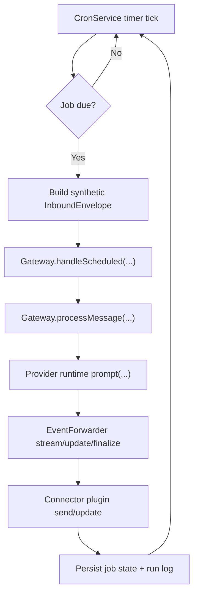

# dobby 定时任务技术方案（Draft）

> 状态：Draft / 待 Review  
> 日期：2026-03-05  
> 目标：在当前 dobby 架构下增加“可调度任务”，并将执行结果回传到对应 connector 的目标会话（channel/thread/DM 等）。

---

## 1. 背景与目标

当前 `dobby` 的执行入口是「连接器入站消息」（例如 Discord `messageCreate` 事件）触发 Gateway 流程。项目尚无“后台定时触发”能力。

本设计希望实现：

1. 支持一次性与周期性任务（at/interval/cron）。
2. 到点自动执行任务（调用现有 provider/sandbox 路由链路）。
3. 结果自动回传到目标 connector 会话（channel/thread/DM）。
4. 与现有架构保持一致：**不破坏扩展系统边界，不引入双执行链路**。
5. 默认不复用聊天会话状态（no shared conversation memory），避免 Cron 与日常对话互相污染。

---

## 2. 现状（dobby）

### 2.1 当前消息主链路

- 以 Discord connector 为例：`messageCreate` -> `emitInbound` -> `Gateway.handleInbound`。
- Gateway 内已具备：
  - 去重（dedup）
  - 路由解析（route）
  - provider runtime 复用与串行执行（conversation 级）
  - 流式事件转发与最终消息更新（`_Thinking..._` + delta + finalize）

### 2.2 关键约束

- 目前没有 scheduler 生命周期管理。
- 扩展系统只有 `provider | connector | sandbox` 三类 contribution。
- 现有 `RuntimeRegistry` 的“串行队列模型”可借鉴用于 Cron 并发控制；但 scheduled 默认不走 `getOrCreate` 的长期会话复用路径。

---

## 3. 外部项目调研结论

### 3.1 openclaw（建议重点借鉴）

openclaw 的 cron 子系统较完整，值得借鉴的点：

1. **任务模型清晰**：`schedule + payload + delivery + state`。
2. **调度鲁棒性**：
   - 启动恢复（stale running 标记清理、missed jobs 补跑）
   - 单任务超时保护
   - 连续失败退避（backoff）
   - 并发上限
3. **执行与投递分离**：
   - 先跑任务，再统一走 delivery dispatch（announce/direct/webhook）
4. **可观测性较强**：
   - 事件广播（started/finished/removed）
   - run log 追加记录

### 3.2 nanoclaw（可局部借鉴）

nanoclaw 优点：

1. 结构直接（`scheduled_tasks + task_run_logs`）。
2. IPC + tool 的权限模型清晰（main 可跨组，普通组仅限本组）。
3. 实现成本低，便于快速起步。

nanoclaw 的不适配点：

- 定时任务结果默认不自动回用户，通常需要任务内显式调用 `send_message`。
- 这会造成“任务执行完成但用户看不到结果”的产品风险，不符合 dobby 期望。

---

## 4. 推荐方案（dobby）

### 4.1 核心决策

采用 **Host 内置 CronService + 复用 Gateway 入站执行链路**。

简述：到点后构造一条 synthetic inbound message，交给 Gateway 执行，让现有 `EventForwarder` + connector `send` 流程完成回传。

这样得到的收益：

1. 无需维护第二套“任务执行 -> 消息发送”逻辑。
2. 自动复用现有流式输出、tool 状态、错误回写。
3. 会话串行、stop/abort 语义更一致。
4. 设计与当前架构耦合最小。

### 4.2 Connector 无关原则

Cron 设计应保持 connector-agnostic，避免绑定 Discord 语义：

1. Scheduler 的唯一执行入口是 `Gateway.handleScheduled(...)`（synthetic inbound），不直接依赖 Discord SDK 细节。
2. v1 将任务目标定义为**结果回传通道**（`delivery`），字段先收敛为 `connectorId + routeId + channelId (+threadId)`。
3. 每个 connector 的文本长度、`updateStrategy`（`edit/final_only/append`）、线程能力等差异，继续由 `EventForwarder + connector plugin` 处理。
4. 文档与实现里提到 Discord 的地方都视为“示例 connector”，不是 Cron 的架构前提。

### 4.3 配置边界（采纳建议）

建议将 Cron 配置从 `gateway.json` 中拆出，使用独立配置文件：

1. `gateway.json` 继续只描述 gateway 核心（routing/providers/connectors/sandboxes/data）。
2. `cron.json` 独立描述调度器参数（enabled/store/poll/concurrency/recovery）。
3. CronService 启动时同时读取：
   - gateway 配置（用于 route/connector 运行时校验）
   - cron 配置（用于调度行为控制）
4. 这样可以降低配置耦合，后续也更容易把 Cron 演进为独立 sidecar。

### 4.4 会话策略（采纳建议）

对于周期性任务，默认采用 **stateless run**：

1. Cron 任务只“借用 connector 通道回消息”，不与该通道日常对话共享会话记忆。
2. 每次触发视为独立执行，不要求保留/恢复该频道的 conversation 状态。
3. 如后续有强需求，再支持显式开启 `shared-session`（可选项，默认关闭）。

### 4.5 术语澄清（本方案关键）

为避免“runtime/session”语义混淆，约定如下：

1. **Runtime（执行实例）**：provider 返回的单次执行对象（`prompt/subscribe/abort/dispose`）。
2. **Conversation session（会话状态）**：跨多轮消息复用的上下文状态（内存或持久化）。
3. **no shared conversation memory** 的含义是：**不复用会话状态**；并不等同于“完全不创建 runtime”。
4. 因此，Cron 默认形态是：**每个 run 创建临时 runtime，执行后立即释放**（transient runtime）。

---

## 5. 架构草图



---

## 6. 数据模型（Draft）

建议使用独立 `cron.json` 与任务存储文件。

### 6.1 cron.json 配置草案（独立于 gateway.json）

```json
{
  "enabled": true,
  "storeFile": "./data/state/cron-jobs.json",
  "runLogFile": "./data/state/cron-runs.jsonl",
  "pollIntervalMs": 10000,
  "maxConcurrentRuns": 1,
  "runMissedOnStartup": true,
  "jobTimeoutMs": 600000
}
```

建议的 cron 配置路径优先级：

1. `DOBBY_CRON_CONFIG_PATH`
2. `<gateway-config-dir>/cron.json`
3. `<data.rootDir>/state/cron.config.json`（自动初始化）

### 6.2 任务模型草案（TypeScript）

```ts
type JobSchedule =
  | { kind: "at"; at: string }                  // ISO 时间
  | { kind: "every"; everyMs: number }
  | { kind: "cron"; expr: string; tz?: string };

type JobDelivery = {
  connectorId: string;      // connector instance id (e.g. discord.main)
  routeId: string;          // existing routing.routes key
  channelId: string;        // result channel/chat id
  threadId?: string;
};

type ScheduledJob = {
  id: string;
  name: string;
  enabled: boolean;
  schedule: JobSchedule;
  sessionPolicy?: "stateless" | "shared-session"; // default: stateless
  prompt: string;
  delivery: JobDelivery;
  createdAtMs: number;
  updatedAtMs: number;
  state: {
    nextRunAtMs?: number;
    runningAtMs?: number;
    lastRunAtMs?: number;
    lastStatus?: "ok" | "error" | "skipped";
    lastError?: string;
    consecutiveErrors?: number;
  };
};
```

---

## 7. 执行链路设计细节

### 7.1 Synthetic InboundEnvelope

到点执行时构造：

- `messageId = "cron:<jobId>:<ts>"`（天然唯一，且纳入 dedup key）
- `userId = "cron"`
- `text = job.prompt`
- `attachments = []`
- `mentionedBot = true`（规避 `allowMentionsOnly` 在群聊时被忽略）
- `routeId = job.delivery.routeId`
- `chatId = job.delivery.channelId`
- `threadId = job.delivery.threadId`（若有）
- `routeChannelId` 在 v1 先与 `channelId` 保持一致（Discord-first）
- `conversationKey` 使用 run 级唯一值（如 `cron:<jobId>:<runTs>`），不复用频道常规会话 key

然后交给 Gateway 处理（建议新增 `handleScheduled` 包装入口，内部复用现有流程）。

### 7.2 Stateless 执行实现建议

为满足“无需额外 conversation 管理”的目标，建议：

1. Scheduler 路径不要走现有 `RuntimeRegistry.getOrCreate(convKey)` 的长期复用语义。
2. 每次任务触发都创建一次临时 runtime（transient），执行完成后立即 `dispose`。
3. provider 侧增加 `sessionPolicy` 提示（`ephemeral`），避免读取/写回持久会话文件。
4. outbound 仍走 connector send（并按 `updateStrategy` 选择 create/update），因此用户看到的仍是同一 channel/thread 回传。
5. 结论：**不共享会话状态 != 不创建 runtime**；只是 runtime 生命周期收敛到单次 run。

### 7.3 为什么不单独“直连 provider + 自己 send 某个 connector”

不建议。会引入第二套：

- thinking 占位逻辑
- streaming 分片逻辑
- tool 事件消息策略
- 错误回写策略

这会在长期演进时造成行为漂移和维护成本上升。

---

## 8. 调度鲁棒性策略（v1）

v1 建议实现以下最小鲁棒性（借鉴 openclaw）：

1. 启动时清理 stale `runningAtMs`。
2. `runMissedOnStartup=true` 时补跑过期任务（每任务仅补一次）。
3. 单任务执行超时（默认 10 分钟，可配置）。
4. 连续错误指数退避（例如 30s/60s/5m/15m）。
5. 定时器最迟 60s 唤醒一次，避免 wall clock 漂移造成长期不触发。
6. 语义采用 **best-effort at-least-once**，v1 不承诺严格 exactly-once。

---

## 9. CLI 草案（先运维，再 Agent 自助）

先做运维 CLI，避免一开始引入 provider tool 改造：

1. `dobby cron add`
2. `dobby cron list`
3. `dobby cron status`
4. `dobby cron run <id>`
5. `dobby cron update <id>`
6. `dobby cron remove <id>`
7. `dobby cron pause/resume <id>`

后续再考虑提供 provider 侧 scheduling tools（供 Agent 在对话中创建任务）。

---

## 10. 拟改动文件清单（落地方向）

### 10.1 配置与类型

- `src/cron/types.ts`（新增 cron config / job types）
- `src/cron/config.ts`（cron config schema + load + normalize）
- `config/cron.example.json`（新增 cron 示例配置）
- `src/core/types.ts`（ProviderRuntimeCreateOptions 增加可选 `sessionPolicy`）

### 10.2 调度核心（新增）

- `src/cron/schedule.ts`
- `src/cron/store.ts`
- `src/cron/service.ts`

### 10.3 启动接线

- `src/cli/commands/start.ts`
  - 加载独立 cron 配置并初始化 CronService
  - 在 shutdown 里 stop CronService

### 10.4 Gateway 执行入口

- `src/core/gateway.ts`
  - 增加 `handleScheduled(job, syntheticInbound)` 或等价方法
  - 复用 `processMessage`，保持执行行为一致
  - 新增“单次 runtime 执行后即释放”的 scheduled path（不经长期 registry）

### 10.5 CLI

- `src/cli/program.ts`
- `src/cli/commands/cron.ts`（新增）
  - 支持 `--cron-config` 可选参数（覆盖默认 cron 配置路径）

---

## 11. 分阶段落地建议

### Phase 1（最小可用）

- JSON store + timer loop + `at/every/cron`
- synthetic inbound 执行
- 自动回传到任务绑定的 connector 会话
- 默认 stateless（单次 runtime，不共享聊天会话）
- CLI: add/list/run/remove

### Phase 2（可运营）

- pause/resume/update/status
- run log（`data/state/cron-runs.jsonl`）
- 启动补跑 + backoff + timeout

### Phase 3（体验增强）

- provider 工具化（对话内创建任务）
- topic/thread 更细粒度 delivery 策略
- 可视化状态面板（未来）

---

## 12. 验收标准（Draft）

1. 到点任务可触发并在目标 connector 会话看到回复（例如 Discord channel/thread）。
2. 回复包含流式更新（不是只在结束时一次性发送）。
3. 任务执行失败时能在对应 connector 会话看到错误信息。
4. 进程重启后可继续调度并恢复执行；在异常边界允许少量重复触发（best-effort）。
5. Cron 引入后不改变现有用户消息会话的串行语义（两者隔离、互不污染）。
6. 默认模式下，Cron 任务不会读取到该频道既有会话上下文（stateless 隔离）。
7. 架构上只保留一条执行链路：`CronService -> Gateway.handleScheduled -> provider runtime -> EventForwarder -> connector`。

---

## 13. 风险与折中

1. **会话语义误解风险**：容易把“stateless”理解为“完全不创建 runtime”，造成实现偏差。
   - 缓解：统一术语，明确“默认是 transient runtime，不复用 conversation memory”。
2. **allowMentionsOnly**：定时任务不是用户 @bot 消息，需显式标记 `mentionedBot=true` 或在调度入口跳过该限制。
3. **时间语义**：cron 时区必须显式策略（默认系统时区，支持 per-job tz）。
4. **重复触发**：在崩溃恢复等异常边界可能出现少量重复触发（best-effort at-least-once）。
   - 缓解：通过 `runningAtMs` + 持久化时序控制尽量降低重复概率。
5. **Connector 能力差异**：不同 connector 的 edit/thread/file 能力不同，需严格走插件能力判断与降级策略。
6. **配置漂移**：cron 配置与 gateway 配置分离后，需在 `cron add/run` 时做 route/connector 存在性校验，避免引用失效。
7. **停止语义差异**：stateless run 不共享聊天 conversation key，`stop` 需通过 cron 管理命令或 job-run 级 abort 实现。

---

## 14. 最终建议

在 dobby 当前架构下，优先采用：

- **openclaw 风格的鲁棒调度内核**
- **dobby 现有 Gateway 执行链路复用**
- **避免 nanoclaw 的“任务需显式 send_message 才回用户”模式**

该方案在工程复杂度、行为一致性、后续演进空间三者之间平衡最好。
